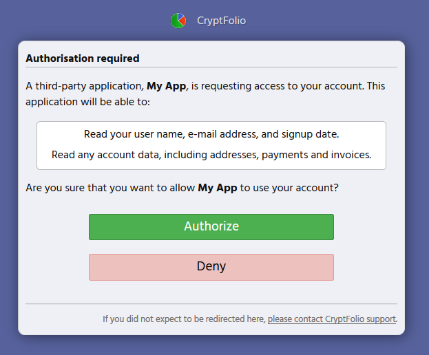

[< Back](../)

# Sample authorisation screen

When you use OAuth2 to request access to a users' account, they will be presented (when you redirect them to `auth_url`) with a screen such as this one:



# Sample authorisation code

### Ruby

Authentication and authorisation is easy with [the oauth2 gem](https://github.com/oauth-xx/oauth2).

```rb
def oauth2_client
  OAuth2::Client.new('<your key>',
    '<your secret>',
    site:          "https://cryptfolio.com",
    token_url:     "/oauth/token",
    authorize_url: "/oauth/authorize")
end

auth_url = oauth2_client.auth_code.authorize_url(redirect_uri: '<your redirect uri>', scope: 'public read')

# At this point, you would redirect the user to auth_url. CryptFolio will handle
# login and authorisation, and once successful, redirects the user to the redirect_uri
# with a code. i.e. /redirect_uri?code=ABC123

# The flow then continues:

code = params[:code]
token = oauth2_client.auth_code.get_token(code, redirect_uri: '<your redirect uri>')

# And then you can use the token as any other endpoint.

currencies = token.get("/api/v1/currencies")
user_info = token.get("/api/v1/user")
```
